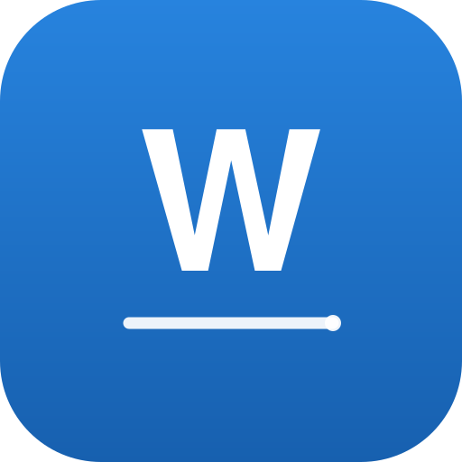

<p align="center">
  
</p>

<h1 align="center">WEWLNSIGN</h1>

<p align="center">Подпись и установка <code>.ipa</code> на iPhone с сертификатом, привязанным к Apple ID.</p>

---

## Что это

Одностраничный сайт (чистый HTML + CSS + JS, без сборки и зависимостей), полностью адаптированный под iPhone:

- загрузка сертификата `.p12`, пароля к нему и профиля `.mobileprovision`;
- загрузка любого `.ipa` файла;
- отображение процесса подписи и установки по шагам с прогрессом;
- список подписанных приложений с реальным 7-дневным сроком действия подписи и обратным отсчётом;
- кнопка «Переподписать» для повторной подписи каждые 7 дней.

## Файлы

| Файл | Назначение |
|---|---|
| `index.html` | весь сайт: разметка, стили и логика в одном файле |
| `icon.svg` | иконка проекта |
| `vercel.json` | настройки статического деплоя на Vercel |

## Деплой на Vercel

1. Откройте [vercel.com/new](https://vercel.com/new).
2. Импортируйте этот репозиторий (**Import Git Repository → WEWLNSIGN**).
3. Framework Preset — **Other**, Build Command и Output Directory оставьте пустыми (это статический сайт).
4. Нажмите **Deploy**.

При каждом пуше в ветку `main` Vercel пересоберёт сайт автоматически.

## Сервис подписи

Подпись `.ipa` — это изменение кодовой подписи внутри пакета приложения, поэтому она **не может выполняться в браузере**: нужен сервер с инструментом подписи (например `zsign`), который принимает `.p12`, пароль, `.mobileprovision` и `.ipa`, а возвращает ссылку на манифест для установки по `itms-services://`.

В начале скрипта в `index.html` есть одна константа:

```js
const SIGN_API = "";
```

- **пусто** — демо-режим: интерфейс, шаги и 7-дневные сроки работают, но реальная подпись не выполняется;
- **адрес сервиса** — сайт отправляет `POST {SIGN_API}/sign` с полями `p12`, `password`, `mobileprovision`, `ipa` и ожидает в ответ JSON вида:

```json
{ "installUrl": "https://example.com/manifest.plist" }
```

После этого установка запускается через `itms-services://` прямо на iPhone.

## После установки

Откройте на iPhone **Настройки → Основные → VPN и управление устройством** и доверьте профилю разработчика.

## Важно

Используйте только с приложениями, на которые у вас есть права. Бесплатный сертификат Apple ID действует 7 дней — по истечении срока приложение нужно переподписать.
